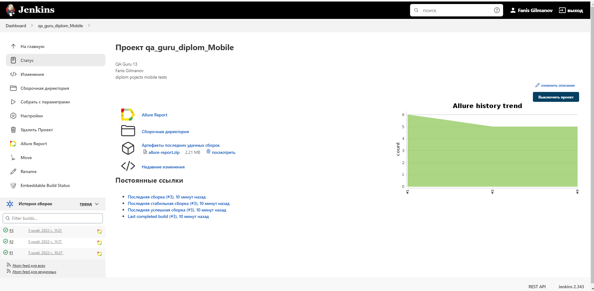
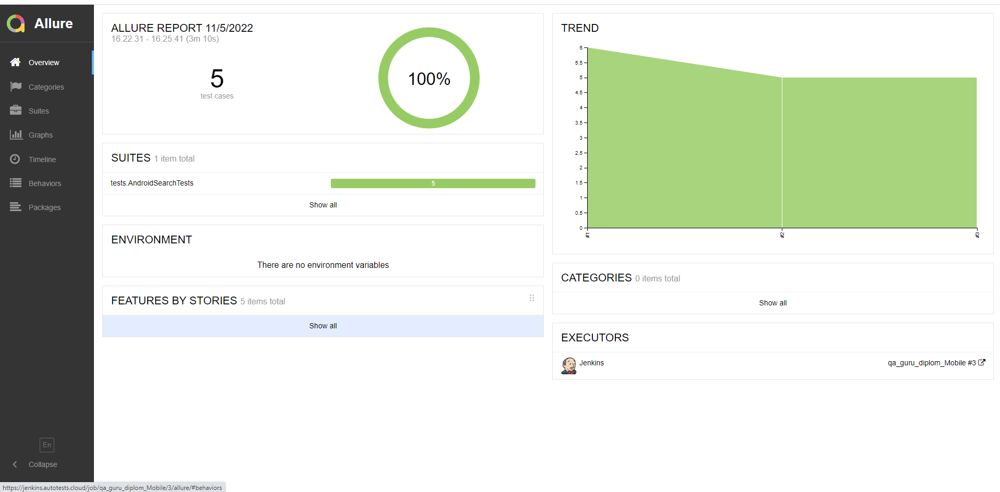
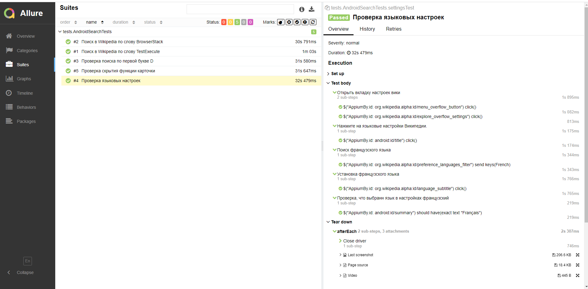
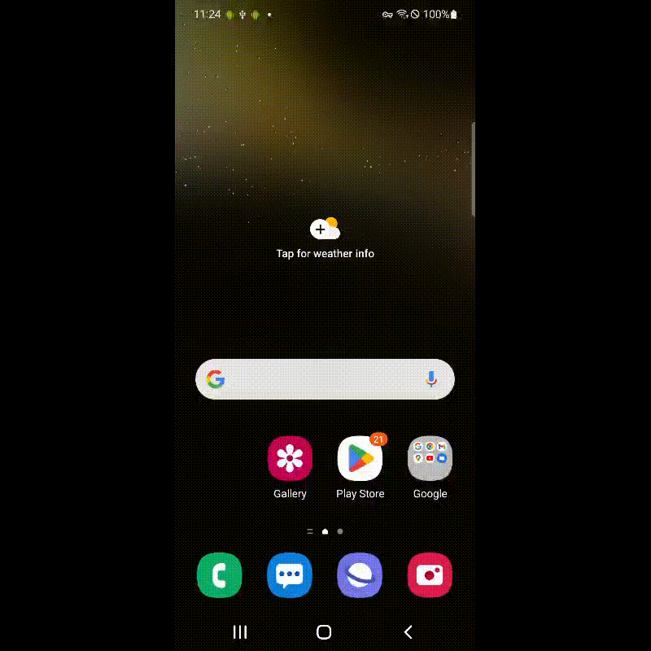
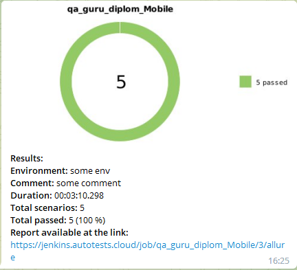

<a href="https://github.com/"></a>
# Демо проект мобильной автоматизации тестирования на Java. Приложение Wikipedia.


## Содержание :bookmark_tabs:
* <a href="#stack">Cтек технологий</a>
* <a href="#objects">Объекты тестирования</a>
* <a href="#console">Запуск тестов из консоли</a>
* <a href="#code">Код</a>
    + <a href="#intelij">InteliJ IDEA, Java, JUnit 5, Selenide, Rest Assured</a>
    + <a href="#gradle">Gradle</a>
* <a href="#screenshot">Скриншоты и видео</a>
  + <a href="#jenkins">Jenkins</a>
  + <a href="#allure">Allure Report</a>
  + <a href="#browserstack">Browserstack</a>
  + <a href="#notifications">Telegram</a>


<a id="stack"></a>
## Cтек технологий :hammer_and_wrench:

<div align="center">
<a href="https://www.jetbrains.com/idea/"></a>
<a href="https://www.java.com/"></a>
<a href="https://junit.org/junit5/"></a>
<a href="https://selenide.org/"></a>
<a href="https://appium.io/"></a>
<a href="https://www.browserstack.co"></a>
<a href="https://gradle.org/"></a>
<a href="https://www.jenkins.io/"></a>
<a href="https://qameta.io/"></a>
<a href="https://github.com/allure-framework/"></a>
<a href="https://github.com/"></a>
</div>


<a id="objects"></a>
## Объекты тестирования :mag:

Разработаны автотесты для проверок:


:white_check_mark: поиск в Wikipedia по слову BrowserStack

:white_check_mark: поиск в Wikipedia по слову TestExecute

:white_check_mark: проверка поиска по первой букве D

:white_check_mark: проверка скрытия функции карточки

:white_check_mark: проверка языковых настроек


<a id="console"></a>
## Запуск тестов из консоли :computer:

```bash
clean test -DdeviceHost=${DEVICEHOST}

```

> `${DEVICE_HOST}` - устройство для прогона тестов [ *browserstack* <sub>(default)</sub> , *emulation*] 


<a id="code"></a>
## Код :floppy_disk:

<a id="intelij"></a>
#### InteliJ IDEA</a>Java</a>JUnit 5</a>Selenide</a>

> *Оформление кода автотестов*

```java


public class AndroidSearchTests extends TestBase {

    @Test
    @DisplayName("Проверка языковых настроек")
    void settingsTest() {
        step("Открыть вкладку настроек вики", () -> {
            $(AppiumBy.id("org.wikipedia.alpha:id/menu_overflow_button")).click();
            $(AppiumBy.id("org.wikipedia.alpha:id/explore_overflow_settings")).click();
        });
        step("Нажмите на языковые настройки Википедии.", () -> {
            $(AppiumBy.id("android:id/title")).click();
        });
        step("Поиск французского языка", () -> {
            $(AppiumBy.id("org.wikipedia.alpha:id/preference_languages_filter")).sendKeys("French");
        });
        step("Установка французского языка", () -> {
            $(AppiumBy.id("org.wikipedia.alpha:id/language_subtitle")).click();
        });
        step("Проверка, что выбранн язык в настройках французский", () -> {
            $(AppiumBy.id("android:id/summary")).shouldHave(exactText("Français"));
        });


    }
}    
```


<a id="gradle"></a>
#### Gradle</a>

> *Автоматическая сборка проекта и управление зависимостями*

```groovy
plugins {
    id 'java-library'
    id 'io.qameta.allure' version '2.9.6'
}

repositories {
    mavenCentral()
}

def allureVersion = "2.18.1",
    selenideVersion = "6.6.6",
    restAssuredVersion = "5.1.1",
    junitVersion = "5.9.0",
    slf4jVersion = "1.7.32",
    ownerVersion = "1.0.12",
    fakerVersion = "1.0.2",
    appiumVersion = "8.1.1",
    commonsIoVersion = "2.11.0"
    
dependencies {
    testImplementation(
            "org.junit.jupiter:junit-jupiter:$junitVersion",
            "org.slf4j:slf4j-simple:$slf4jVersion",
            "io.rest-assured:rest-assured:$restAssuredVersion",
            "com.codeborne:selenide:$selenideVersion",
            "io.qameta.allure:allure-selenide:$allureVersion",
            "io.qameta.allure:allure-rest-assured:$allureVersion",
            "org.aeonbits.owner:owner:$ownerVersion",
            "com.github.javafaker:javafaker:$fakerVersion",
            "io.appium:java-client:$appiumVersion",
            "commons-io:commons-io:$commonsIoVersion"
    )
}
```


<a id="screenshot"></a>
## Скриншоты и видео :camera_flash:


<a id="jenkins"></a>
#### Jenkins</a>

> *Решение комплекса задач по сборке проекта, прогону автотестов, получению отчетов и отправке уведомлений по
результатам сборки*

<a href="https://jenkins.autotests.cloud/job/qa_guru_diplom_Mobile/">

</a>


<a id="allure"></a>
#### Allure Report</a>

> *Формирование отчетов по результам прогона автотестов*

<table>
     <tr>
        <td>
        <a href="https://jenkins.autotests.cloud/job/qa_guru_diplom_Mobile/3/allure/">
        
        </a>
        </td>
        <td>
        <a href="https://jenkins.autotests.cloud/job/qa_guru_diplom_Mobile/3/allure/#suites/931af5ed5b63c00d89301b3b329c12d8/4263a25fc6e8c837/">
        
        </a>
        </td>
    </tr>
</table>

<a id="browserstack"></a>
#### Browserstack</a>

<p align="center"> 
   
</p>

<a id="notifications"></a>
#### Telegram</a>

> *Предоставление оперативной информации о результатах прогона автотестов*

<table>
     <tr>
        <td>
        
        </td>
    </tr>
 </table>   
